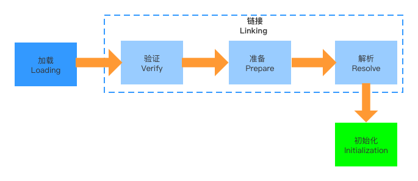

# JVM类加载机制

## 一、类加载机制

### 1.1 加载-Loading

把类的.class文件中二进制数据加载到内存中，将其放在运行时数据区的方法区内，然后在堆区创建一个java.lang.Class实例，用来封装类在方法区内的数据结构。

 JVM在此阶段主要完成三件事：

- 1、通过一个类的全限定名来获取其定义的二进制字节流
- 2、将这个字节流所代表的静态存储结构转为方法区的运行时数据结构
- 3、在堆区类创建一个代表此类的java.lang.Class实例，作为方法区中这些数据的访问入口

### 1.2 链接-Linking

#### 1.2.1 验证-Verify

验证Class文件，确保Class文件的字节流中包含信息符合虚拟机要求，保证被加载类的正确性、安全性。主要验证包括，文件格式验证、元数据验证、字节码验证、符号引用验证。

#### 1.2.2 准备-Prepare

为类变量（静态变量）分配内存并设置该类变量的默认初始值，即零值。

* 如果变量被static final修饰，在准备阶段就会被显示初始化，因为final在编译时就会分配
* 此阶段不会为实例变量分配初始化，类变量会分配在方法区中，而实例变量会和实例对象一起分配在Java堆中

#### 1.2.3解析-Resolve

将常量池中的符号引用转换为直接引用的过程。事实上，解析操作往往会伴随着JVM在执行初始化之后再执行。

### 1.3 初始化-Initialization

初始化阶段是类加载机制的最后一步，在此阶段前面的准备阶段中，会为类变量分配内存并初始化零值，在此阶段中会根据实际前值来进行赋值。简单的说，初始化阶段就是执行类构造器<clinit>( )方法的过程。

#### 1.3.1 `<clinit>()`方法

* 此方法无需定义，是javac编译器自动收集类中的所有类变量的赋值动作和静态代码块中的语句合并而来，不是一定存在的
* `<clinit>()`不同于类的构造器
* 若该类具有父类，JVM会保证子类的`<clinit>()`执行前，父类的`<clinit>()`已经执行完毕
* 虚拟机必修保证一个类的`<clinit>()`方法在多线程下被同步加锁

#### 1.3.2 初始化时机

* 创建类的实例，也就是new一个对象

* 调用类或接口的静态变量，或对静态变量进行赋值

* 调用类的静态方法

* 反射创建一个类的实例

* 初始化某类的子类，其（父类）也会被初始化

  

## 二、类加载器

* 引导类加载器：由c语言实现，加载核心的类
* 扩展类加载器：由java实现，是sun.mic.Launcher内部类
* 系统类加载器：由java实现，是sun.mic.Launcher内部类
* 自定义类加载器

### 2.1 双亲委派机制

如果一个类加载器收到了类加载的请求，它不会自己先去加载，而是把请求委托给父类的加载器去加载。如果父类加载器还存在其父类加载器，则会进一步向上委托，最终达到顶层的引导类加载器。如果父类无法完成加载工作，子类才会尝试加载。这就是双亲委派机制的工作原理。

为什么要使用双亲委派机制？

- 避免类重复加载
- 保护程序的安全，防止核心API被随意篡改

## 附

- 查看字节码工具：JClassLib,PXBinaryViewer
- javap反编译